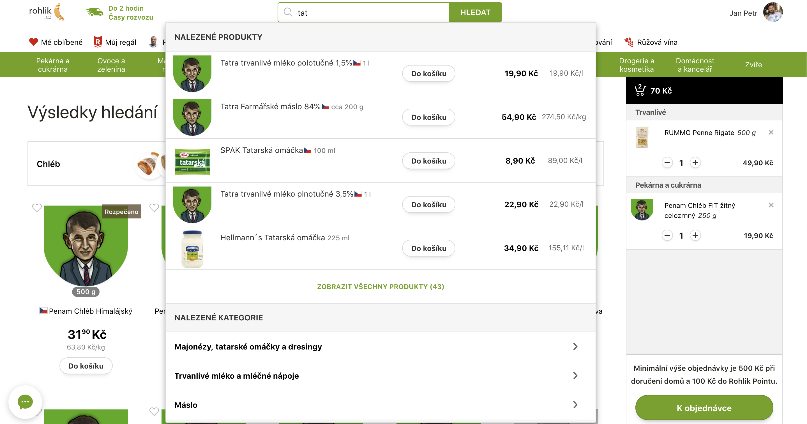

# Babiš v Rohlíku

Pokaždé, když vytáhneš peněženku, vybíráš si, jaký chceš svět. Že seš malej pán? I pár drobáků udělá za pár let pěknou kopu peněz. Vyber si, komu pomáháš stavět hnízdo.

**Babiš v Rohlíku** je plugin pro Google Chrome a Firefox, který nahradí obrázek produktu obrázkem Babiše, pokud daný produkt vyrábí firma spadající do holdingu.

## Instalace

### Máš Google Chrome?
1. Najdi rozšíření na [Google Web Store](https://chrome.google.com/webstore/detail/babi%C5%A1-v-rohl%C3%ADku/bphomdbffkdiekkihhmmioegdholgdim)
2. Klikni na tlačítko "Přidat do Chromu"
3. Potvrď klepnutím na "Přidat rozšíření"

### Máš Firefox?
1. Najdi rozšíření na [Firefox Add-ons](https://addons.mozilla.org/en-US/firefox/addon/babis-v-rohliku/)
2. Klikni na tlačítko "Přidat do Firefoxu"
3. Potvrď klepnutím na "Přidat"

## Contribution

Pokud najdete jakoukoli chybku nebo budete chtít rozšiřit funkčnost pluginu, neváhejte a vytvořte [nové Issue](https://github.com/JanPetr/babis-v-rohliku/issues/new) nebo, pokud jste developer, pošlete rovnou [Pull Request](https://github.com/JanPetr/babis-v-rohliku/compare).

## Credits

Za grafické podklady díky [Adéle Červíkové](https://www.instagram.com/acervikova/) a [Ondrovi Pospíšilovi](https://poon.cz/webdesigner-kreativec-na-volne-noze/ondrej-pospisil) ❤️
